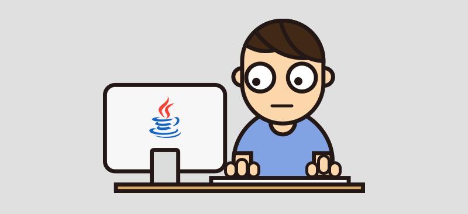

  
 

  
# 👋🏻 Ola! Me chamo Juliano Martins e sou desenvolvedor de sistemas! Sejam bem vindos

  
  

---

## Sobre mim

Desenvoledor de sistemas com experiência no ecossistema <Strong>Java</Strong>, graduado em <Strong>Análise
e Desenvolvimento de Sistemas</Strong> e pós graduado em <Strong>Desenvolvimento de Sistemas Web</Strong>.

 

Desenvolvo sistemas obustos utilizando <Strong>Spring boot</Strong>, utilizando tecnologias como <Strong>Spring Security</Strong>, 
<Strong>Spring JPA</Strong>, criação de <Strong>API REST</Strong> escaláveis seguindo os padrões de arquitetura em camadas,
boas praticas de programação adepto ao <Strong>Clean Code</Strong e aos principios <Strong>SOLID</Strong>

 

Possuo compentências complementares em <Strong>JavaScript</Strong> e <Strong>React JS</Strong>, utilizando conceitos
modernos de componentização para criar interfaces de alta performance, isso somado ao <Strong>HTML</Strong> e <Strong>CSS</Strong>. 
Entre esses, acrescento experiência com <Strong>C#</Strong> e seu framework <Strong>ASP.Net Core</Strong> e <Strong>Python</Strong> para 
a realização de <Strong>Análise de Dados</Strong>

---

   ## Tecnologias

 

 
  
  
  
  
    
  
  
  
  
  
  
  
  
  
  
  

###

###

###

###

  
---

## Contatos

  
  

  
    
  
    
  
    
  
  

---

  
  
  
  

---

